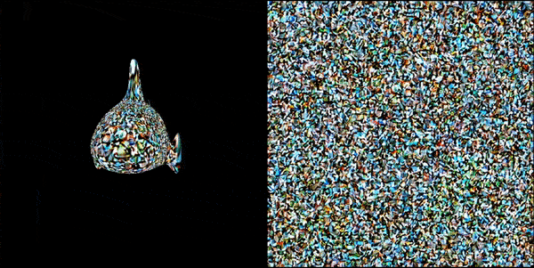

# Latent-Paint-Mesh

NVDiffrast based implementation of Latent-Paint from [Latent-NeRF](https://github.com/eladrich/latent-nerf)

Use Stable Diffusion to create textures for meshes



# Quickstart

Use the following  to get started

# Setup

```
git clone https://github.com/NasirKhalid24/Latent-Paint-Mesh.git
cd Latent-Paint-Mesh
pip install -r requirements.txt

# Create a TOKEN file with your huggingface token from https://huggingface.co/settings/tokens
echo -n YOUR_TOKEN_HERE >> TOKEN
```

# Usage

```
python main.py --mesh data/blub/blub_triangulated.obj --text "Goldfish" --epochs 2500 --log 250
```