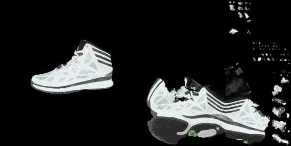

# Latent-Paint-Mesh

NVDiffrast based implementation of Latent-Paint from [Latent-NeRF](https://github.com/eladrich/latent-nerf)

Use text to edit textures of a 3D model or create new ones - powered by Stable Diffusion

Creating texture with prompt "Goldfish"


Editing an existing texture with prompt "Air Jordan 1"



# Quickstart

Use the following [Google Colab notebook](https://colab.research.google.com/drive/1JRjTCRX0FSZBAufEVLAyp0TP0EbGuupP?usp=sharing) to get started - creating a texture map for 3d car model using text prompt "Lightning McQueen" (~5 mins)

# Setup

```
git clone https://github.com/NasirKhalid24/Latent-Paint-Mesh.git
cd Latent-Paint-Mesh
pip install -r requirements.txt

# Create a TOKEN file with your huggingface token from https://huggingface.co/settings/tokens
echo -n YOUR_TOKEN_HERE >> TOKEN
```

# Usage

```
python main.py --mesh data/blub/blub_triangulated.obj --text "Goldfish" --epochs 2500 --log 250
```

```
  optional arguments:
  --gpu GPU            GPU index (default 0)
  --mesh MESH          Path to .obj must have uv unwrapped
  --material MATERIAL  Path to starting material, if none will randomly initialize
  --text TEXT          Text prompt
  --lr LR              Learning rate
  --scale SCALE        Factor by which to scale up 64x64 texture map (default 2)
  --log LOG            Log every x epochs, set to -1 to disable logging (much faster)
  --dist_min DIST_MIN  Minimum camera distance
  --dist_max DIST_MAX  Maximum camera distance
  --azim_min AZIM_MIN  Minimum camera azimuth in degrees
  --azim_max AZIM_MAX  Maximum camera azimuth in degrees
  --elev_min ELEV_MIN  Minimum camera elevation in degrees wrt x plane (use -x and +x for elevation)
  --elev_max ELEV_MAX  Maximum camera elevation in degrees wrt x plane (use -x and +x for elevation)
  --fov_min FOV_MIN    Minimum FOV in degrees
  --fov_max FOV_MAX    Maximum FOV in degrees
  --offset             Offset mesh from center
  --colab              Enable for google colab logging
  --prompt_aug         Prompt augmentatio (side, back)
  --epochs EPOCHS      How many iterations to run for
  --guidance GUIDANCE  Guidance scale for cfg
```